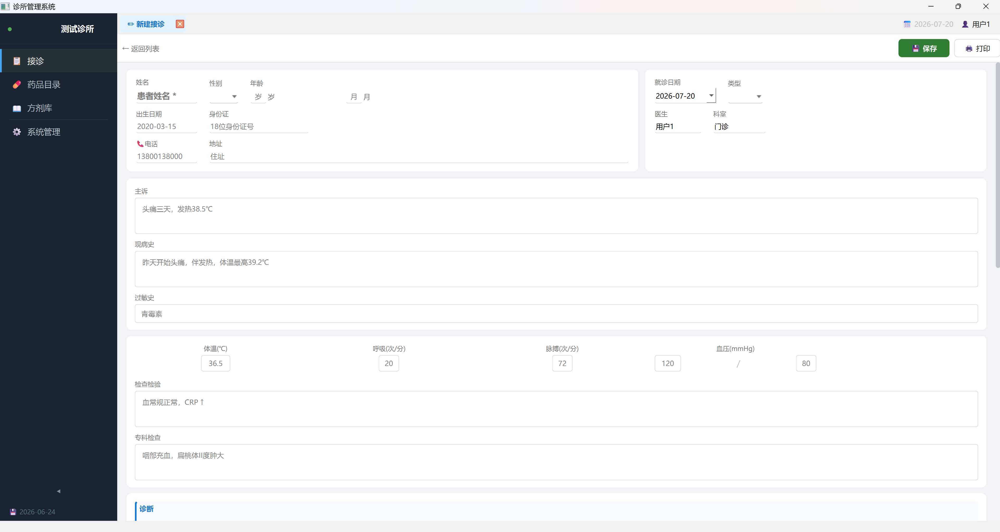
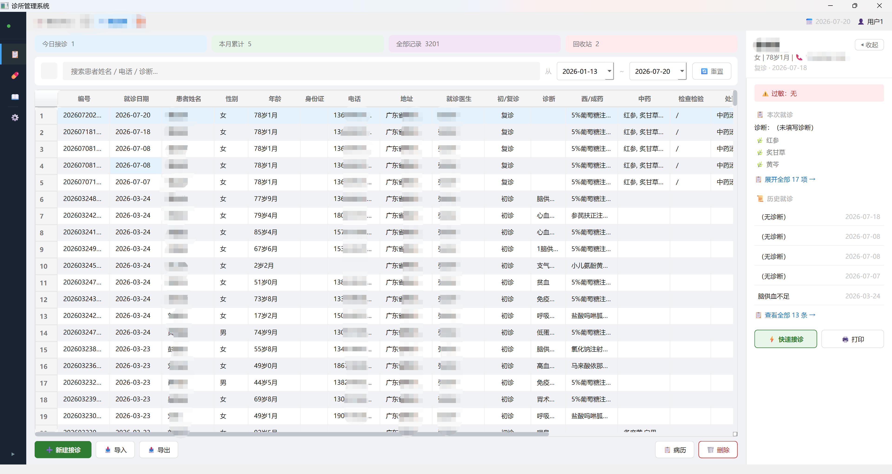
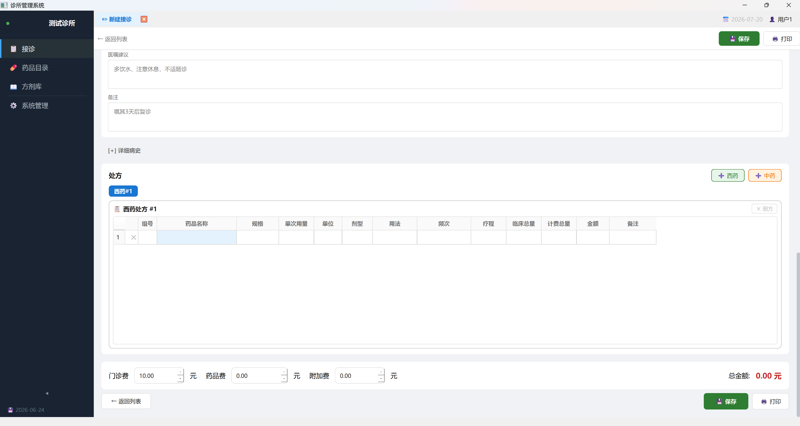
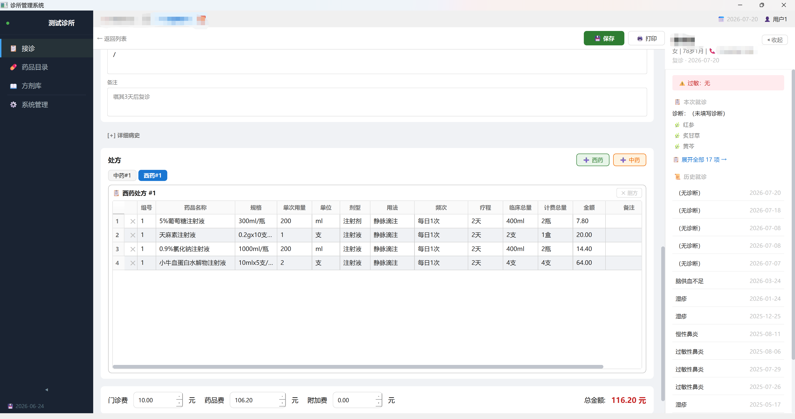
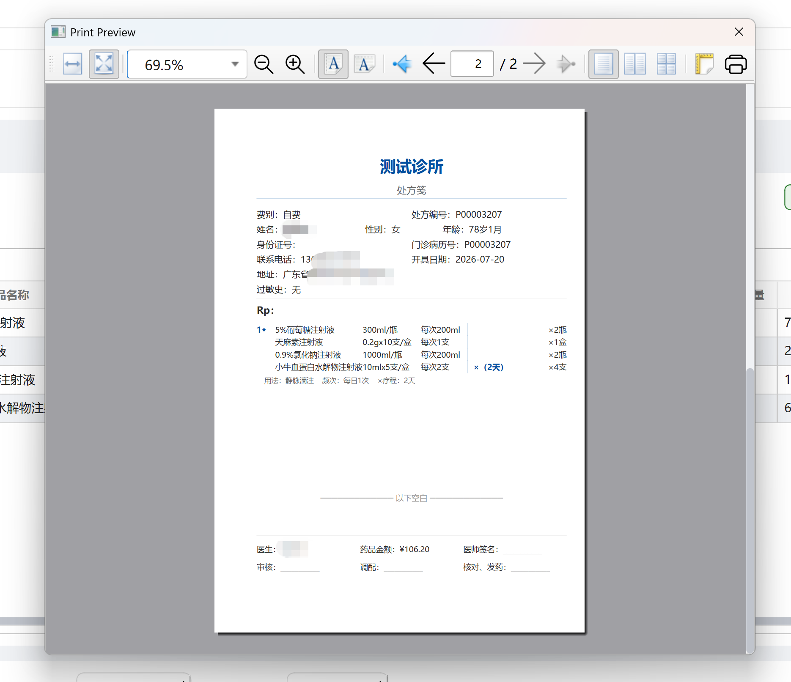
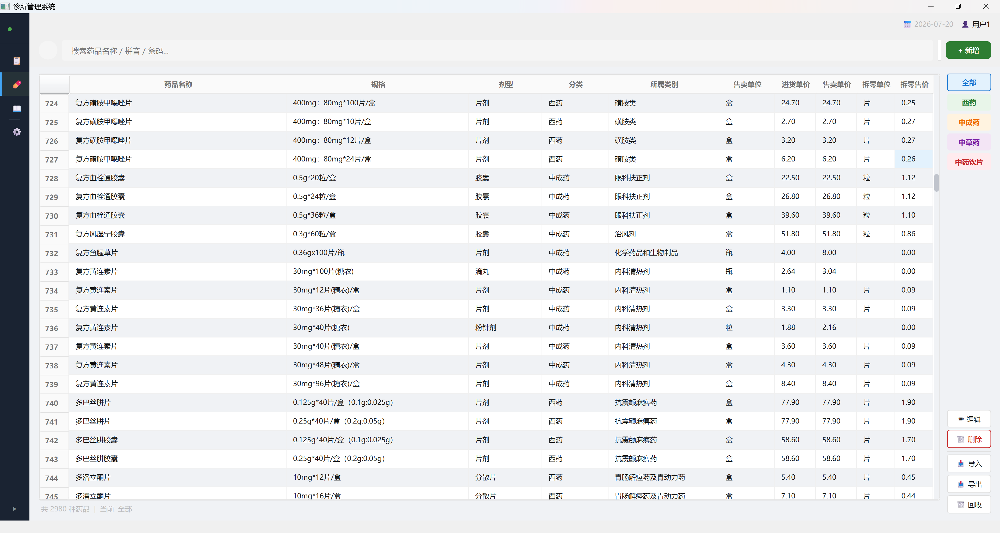
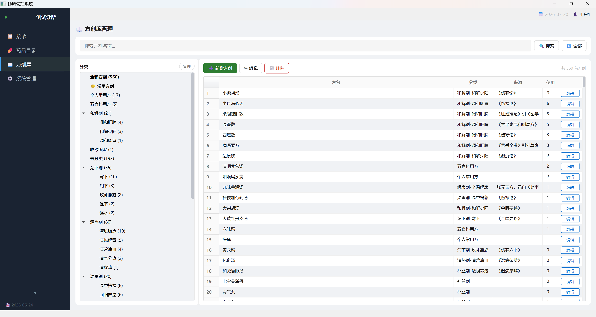
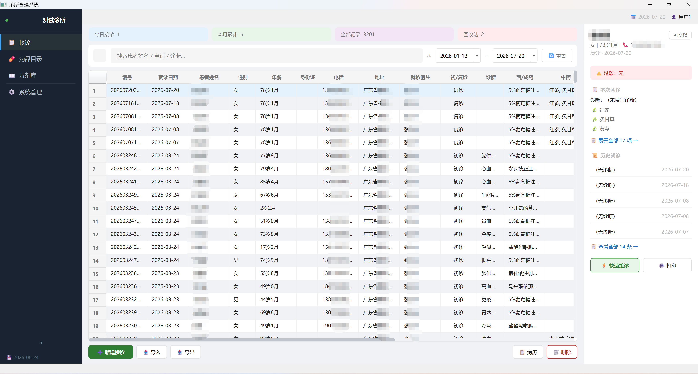
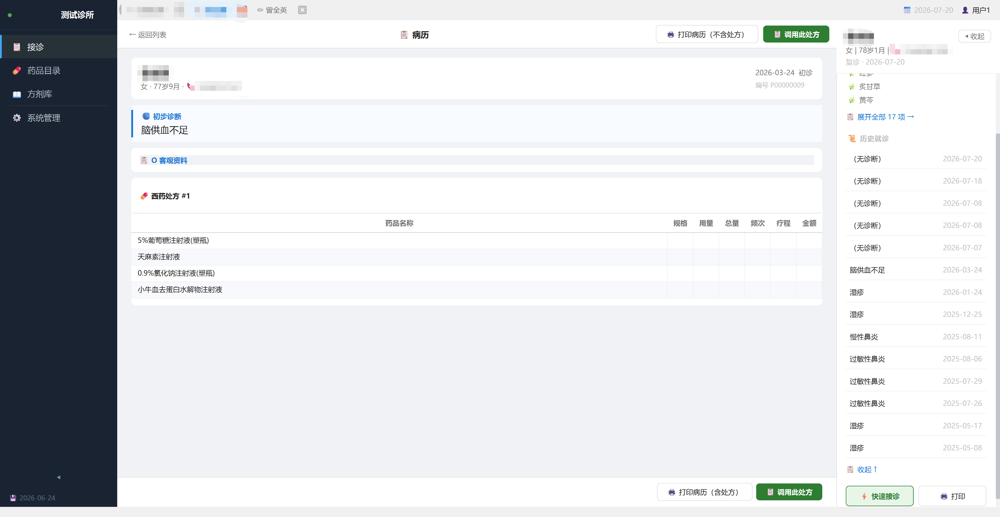
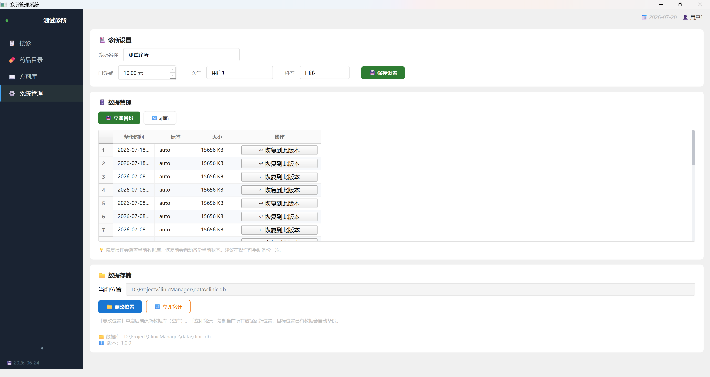

# 🏥 ClinicManager 诊所管理系统

个体医生诊所管理软件，支持接诊日志管理、处方打印、药品目录和方剂库管理。

## 技术栈

| 层 | 技术 |
|------|------|
| 语言 | Python 3.12 |
| GUI | PySide6 (Qt 6) |
| 数据库 | SQLAlchemy + SQLite |
| 架构 | 四层 DDD（Domain-Driven Design） |
| 打包 | PyInstaller |

## 架构特色

项目采用**四层 DDD 架构**，严格遵循依赖方向：

```
UI (PySide6) → Application (Controller/Presenter) → Domain (纯数据对象)
                                                          ↑
Services (SQLAlchemy CRUD) ───────────────────────────────┘
```

- **Domain 层零框架依赖**：不导入 PySide6、SQLAlchemy
- **UI 层不直接调用 Services**：所有业务逻辑通过 Application 层的 Controller 编排
- **每个功能模块一个 Controller**：职责清晰，测试友好

## 功能展示

### 📋 接诊管理
新建接诊 → 填写患者信息、SOAP 病历 → 开处方 → 预览打印 → 保存归档

| 新建接诊 | 接诊列表 |
|---------|---------|
|  |  |

| 处方编辑 | 调用历史处方 |
|---------|------------|
|  |  |

### 🖨 处方打印
- A5 处方笺打印
- 打印预览 / 直接打印 / 导出 PDF / 导出 HTML（四种输出方式）
- 西药表格 + 中药双栏 + 注射剂竖线疗程标记
- 药品超长自动折行、组内跨页续画



### 💊 药品目录管理
- 2980 种药品，支持分类管理
- 拼音简码、五笔简码搜索



### 📜 方剂库
- 560 条中药方剂
- 按分类树组织
- 方剂 → 处方一键转换



### 📊 其他功能

| 患者卡片 | 历史病历 | 系统管理 |
|---------|---------|---------|
|  |  |  |

## 下载体验

从 [Releases](https://github.com/wangcai1937-glitch/ClinicManager1.0/releases) 下载最新版，解压后运行 `ClinicManager/ClinicManager.exe` 即可。

> 内含 2980 种药品和 560 条方剂，开箱即用。
> 无患者数据，首次启动需等待数据库初始化。

## 项目结构

```
ClinicManager.exe          ← 主程序
├── data/                  ← 数据目录（自动创建）
│   ├── clinic.db         ← 药品目录 + 方剂库
│   └── settings.json     ← 配置信息
└── _internal/            ← PyInstaller 运行时库
```
